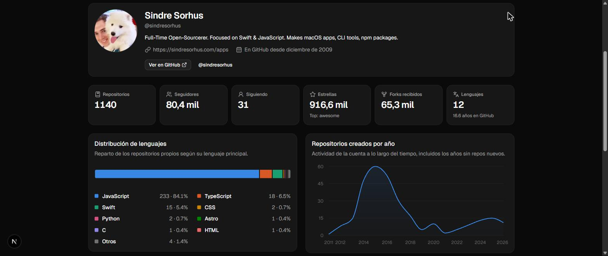
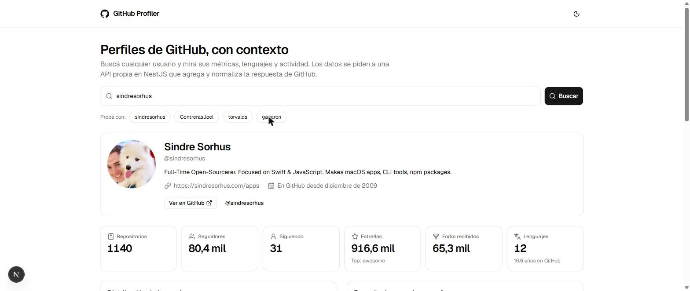

# GitHub Profiler

Aplicación que muestra el perfil público de cualquier usuario de GitHub con métricas y
gráficos derivados de sus repositorios. El frontend consume **exclusivamente** una API
propia hecha en NestJS, que es la única que habla con `api.github.com`.

| | |
|---|---|
| **Demo** | _(pendiente de desplegar)_ |
| **API** | https://profiler-api.ukitech.site · documentación interactiva en [`/docs`](https://profiler-api.ukitech.site/docs) |
| **Repo** | https://github.com/ContrerasJoel/profiler-github |
| **Stack** | NestJS 11 · Next.js 16 · TypeScript · Zod · Zustand · shadcn/ui · Recharts · Tailwind v4 |



<details>
<summary>Modo claro</summary>



</details>

---

## Qué hace

El reto pedía mostrar los datos de un perfil propio. La app va un paso más allá:

- **Buscador de usuarios.** Carga un perfil por defecto al abrir (requisito del reto) y
  permite explorar cualquier otro desde un input, con validación en cliente y servidor.
- **Métricas agregadas.** Estrellas y forks totales, repos propios frente a forks,
  lenguajes distintos y antigüedad de la cuenta: datos que GitHub no da hechos y que el
  backend calcula.
- **Tres gráficos** derivados de los repositorios: distribución de lenguajes, ranking por
  estrellas y repositorios creados por año.
- **Estados reales.** Skeletons durante la carga, y errores diferenciados para usuario
  inexistente, rate limit agotado y API caída — cada uno con su acción correspondiente.
- **Modo claro y oscuro**, con paletas de gráfico distintas y validadas para cada fondo.

---

## Arquitectura

```
Navegador ──► Next.js (Vercel)
                 │  fetch NEXT_PUBLIC_API_URL
                 ▼
           NestJS (VPS, Docker, HTTPS vía Nginx Proxy Manager)
                 │  caché en memoria · TTL 5 min
                 ▼
           api.github.com  (autenticado con un PAT que nunca sale del backend)
```

El navegador llama directamente al backend propio. No hay un proxy intermedio en Next,
para que quede explícito que el frontend consume el endpoint creado para el reto.

---

## El endpoint

### `GET /user/:username`

Agrega **dos** llamadas a GitHub (perfil + repositorios) y devuelve todo ya calculado:

<details>
<summary>Ejemplo de respuesta (recortado)</summary>

```jsonc
{
  "profile": {
    "login": "ContrerasJoel",
    "name": "Joel Contreras",
    "avatarUrl": "https://avatars.githubusercontent.com/u/99752831?v=4",
    "bio": "Software Engineer",
    "publicRepos": 2,
    "followers": 1,
    "following": 2,
    "createdAt": "2022-02-15T17:00:55Z",
    "htmlUrl": "https://github.com/ContrerasJoel"
    // company, location, blog, twitterUsername, email, hireable, type, publicGists, updatedAt
  },
  "stats": {
    "totalStars": 0,
    "totalForks": 0,
    "ownRepos": 2,
    "forkedRepos": 0,
    "languagesCount": 1,
    "accountAgeYears": 4.4,
    "mostStarredRepo": null
    // totalWatchers, totalOpenIssues, archivedRepos
  },
  "languages":    [{ "name": "TypeScript", "count": 2, "percentage": 100 }],
  "topRepos":     [{ "name": "…", "stars": 0, "forks": 0, "language": "TypeScript", "topics": [], "htmlUrl": "…" }],
  "reposPerYear": [{ "year": "2025", "count": 1 }, { "year": "2026", "count": 1 }],
  "recentRepos":  [{ "name": "…", "language": "TypeScript", "pushedAt": "…", "htmlUrl": "…" }],
  "meta": {
    "fetchedAt": "2026-07-24T20:13:00.751Z",
    "cached": false,
    "reposAnalyzed": 2,
    "reposTruncated": false,
    "rateLimitRemaining": 4998
  }
}
```

</details>

| Código | Cuándo |
|---|---|
| `200` | Perfil encontrado |
| `400` | El username no cumple el formato de GitHub |
| `404` | El usuario no existe |
| `429` | Rate limit agotado (el nuestro o el de GitHub) |
| `503` | GitHub no responde o devolvió algo con formato inesperado |

Todos los errores comparten la misma forma:

```json
{
  "statusCode": 404,
  "error": "Not Found",
  "message": "El usuario \"noexiste\" no existe en GitHub.",
  "path": "/user/noexiste",
  "timestamp": "2026-07-24T20:13:01.590Z"
}
```

Además: `GET /health` (liveness) y `GET /docs` (Swagger).

---

## Decisiones técnicas

**La agregación vive en el backend.** El endpoint podría devolver el JSON crudo de GitHub
y dejar que el cliente calcule, pero entonces el navegador descargaría cientos de
repositorios para pintar seis números. Devolvemos solo lo que se renderiza, y la lógica
queda en un sitio testeable.

**Dos peticiones, no N.** La distribución de lenguajes sale del campo `language` de cada
repositorio (su lenguaje dominante). El desglose exacto por bytes exigiría llamar a
`/repos/:owner/:repo/languages` una vez por repositorio — con 300 repos serían 300
peticiones y el rate limit se agotaría en dos búsquedas. Se pierde precisión en repos
políglotas; a cambio, la app funciona.

**Los forks se excluyen de las métricas.** Contarlos inflaría lenguajes, años y estrellas
con código que el usuario no escribió. El total de forks sí se muestra aparte.

**Zod en los dos extremos y en las dos direcciones.** Valida el username que entra, la
respuesta que GitHub devuelve y —desde el frontend— la respuesta de nuestra propia API.
Si un deploy desincroniza front y back, falla con un mensaje claro en vez de romperse a
mitad de un gráfico.

**Caché en memoria antes que Redis.** Con una sola instancia, un `Map` con TTL resuelve
el problema real (no quemar el rate limit) sin añadir infraestructura. La interfaz es
deliberadamente pequeña por si algún día hay que cambiarla.

**Paleta de gráficos validada, no elegida a ojo.** Los ocho colores categóricos se
comprobaron con un validador: banda de luminosidad, croma mínimo, separación bajo
daltonismo (ΔE ≥ 8 en pares contiguos) y contraste contra cada fondo. El modo oscuro usa
sus propios tonos, no una inversión automática. Como en modo claro tres tonos no llegan a
3:1, todos los gráficos muestran siempre el valor como texto: el color nunca es el único
canal de información.

**Sin React Query.** El estado del servidor lo lleva un único store de Zustand con un
contador de peticiones que descarta respuestas obsoletas. Para una vista es suficiente y
mantiene el stack acotado.

---

## Correr en local

Requiere Node 22+.

```bash
# 1. Backend  → http://localhost:3001
cd backend
cp .env.example .env          # opcional: rellenar GITHUB_TOKEN
npm install
npm run start:dev

# 2. Frontend → http://localhost:3000
cd ../frontend
cp .env.example .env.local
npm install
npm run dev
```

Sin `GITHUB_TOKEN` funciona igual, pero GitHub limita a 60 peticiones/hora por IP. Con un
token (no necesita ningún scope: solo lee datos públicos) sube a 5.000.

### Variables de entorno

**backend/.env**

| Variable | Por defecto | Para qué |
|---|---|---|
| `PORT` | `3001` | Puerto de escucha |
| `GITHUB_TOKEN` | — | PAT de GitHub; sube el rate limit a 5.000/h |
| `CORS_ORIGINS` | `http://localhost:3000` | Orígenes permitidos, separados por comas |
| `CACHE_TTL` | `300` | Segundos que un perfil vive en caché |

**frontend/.env.local**

| Variable | Para qué |
|---|---|
| `NEXT_PUBLIC_API_URL` | URL base del backend |
| `NEXT_PUBLIC_DEFAULT_USERNAME` | Perfil que se carga al abrir la página |

### Tests

```bash
cd backend
npm test        # agregación de métricas (casos borde: sin repos, sin estrellas, cola larga)
npm run test:e2e   # health + validación de entrada, sin tocar la red
```

---

## Despliegue

**Backend** — VPS con Docker, publicado por Nginx Proxy Manager con certificado de
Let's Encrypt en `profiler-api.ukitech.site`:

```bash
git clone https://github.com/ContrerasJoel/profiler-github.git
cd profiler-github
cp backend/.env.example backend/.env   # rellenar GITHUB_TOKEN y CORS_ORIGINS
docker compose up -d --build
curl localhost:3001/health
```

Después, en Nginx Proxy Manager: nuevo *Proxy Host* para `profiler-api.ukitech.site`
apuntando al puerto `3001`, con SSL de Let's Encrypt y *Force SSL* activados.
Para actualizar: `git pull && docker compose up -d --build`.

**Frontend** — Vercel, con *Root Directory* = `frontend` y las dos variables
`NEXT_PUBLIC_*`. Una vez desplegado hay que añadir la URL de Vercel a `CORS_ORIGINS` en el
VPS y reiniciar el contenedor — es el paso que más se olvida y produce el clásico error de
CORS en producción.

---

## Con más tiempo

- Desglose real de lenguajes por bytes, precalculado en segundo plano en vez de en la
  petición del usuario.
- Vista de tabla junto a cada gráfico, para lectura con lector de pantalla y exportación.
- Comparador de dos perfiles lado a lado.
- Redis en lugar de la caché en memoria, para poder escalar a varias réplicas.
- Tests de componente del frontend (hoy solo hay tests del backend).
